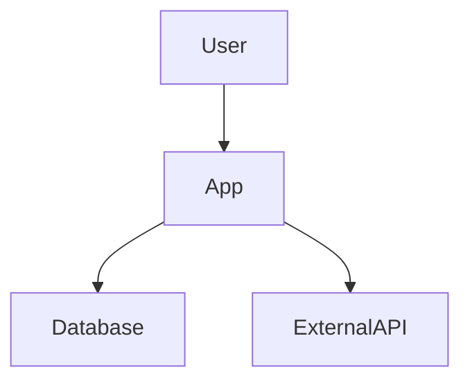
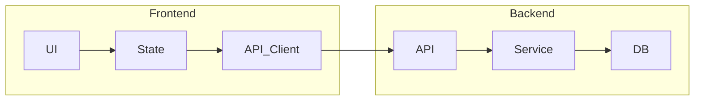
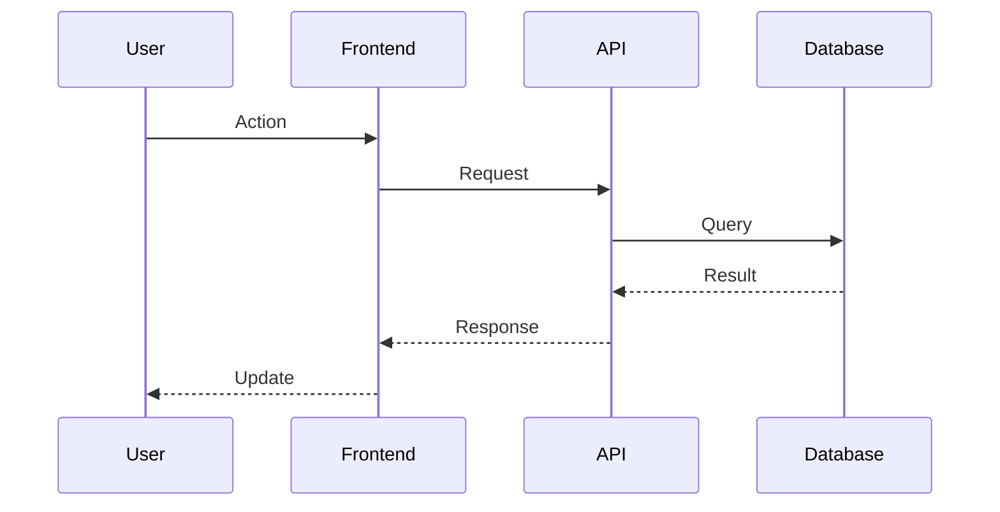

# AMP-OS: Complete Implementation Plan

> A full adaptation of Agent OS for Amp CLI using native skills for context-efficient, lazy-loaded spec-driven development workflows.

---

## Table of Contents

1. [Executive Summary](#executive-summary)
2. [Master Folder Structure](#1-master-folder-structure-amp-os)
3. [Project Install Structure](#2-project-install-structure)
4. [Configuration Files](#3-configuration-files)
5. [SKILL.md Definitions](#4-skillmd-definitions)
6. [Agent Prompt Templates](#5-agent-prompt-templates)
7. [Installation Script Logic](#6-installation-script-logic)
8. [Minimal AGENTS.md Template](#7-minimal-agentsmd-template)
9. [Feature Parity Checklist](#8-feature-parity-checklist)

---

## Executive Summary

**AMP-OS** is a full port of Agent OS to Amp CLI, using Amp's native skill system for context-efficient, lazy-loaded spec-driven development workflows.

### Key Benefits Over Original Agent OS

| Aspect | Agent OS (Claude Code) | AMP-OS (Amp CLI) |
|--------|------------------------|------------------|
| Context Loading | Commands always load full context | Skills lazy-load on demand |
| Planning/Review | Basic prompts | Oracle tool (o3 model) |
| Task Tracking | Manual tasks.md | Native `todo_write`/`todo_read` |
| Code Search | Basic grep | Semantic `finder` tool |
| Diagrams | Manual | Native `mermaid` tool |
| Subagents | Claude Code subagents | Flexible `Task` tool |

### Architecture Philosophy

- **Master folder** (`~/Amp-OS`) stores all standards, workflows, skills, and templates
- **Install script** deploys to any project via symlinks or copies
- **Skills** are lazy-loaded, solving the AGENTS.md context bloat problem
- **Full feature parity** with Agent OS plus Amp-native enhancements

---

## 1. Master Folder Structure (`~/Amp-OS`)

```
~/Amp-OS/
├── config.yml                          # Master configuration
├── README.md                           # Documentation
├── scripts/
│   ├── amp-project-install.sh          # Main install script
│   ├── amp-project-update.sh           # Update existing installs
│   ├── create-profile.sh               # Create new profiles
│   └── common-functions.sh             # Shared bash utilities
│
└── profiles/
    └── default/                        # Default profile (can create: rails, node, python, etc.)
        │
        ├── skills/                     # SKILL directories (copied/symlinked to projects)
        │   │
        │   ├── plan-product/           # Phase 1: Product Planning
        │   │   ├── SKILL.md
        │   │   └── resources/
        │   │       ├── planning-workflow.md
        │   │       └── roadmap-template.md
        │   │
        │   ├── shape-spec/             # Phase 2: Research & Requirements
        │   │   ├── SKILL.md
        │   │   └── resources/
        │   │       ├── research-workflow.md
        │   │       └── requirements-template.md
        │   │
        │   ├── write-spec/             # Phase 3: Specification Writing
        │   │   ├── SKILL.md
        │   │   └── resources/
        │   │       ├── write-spec-workflow.md
        │   │       └── spec-template.md
        │   │
        │   ├── create-tasks/           # Phase 4: Task Breakdown
        │   │   ├── SKILL.md
        │   │   └── resources/
        │   │       ├── create-tasks-workflow.md
        │   │       └── tasks-template.md
        │   │
        │   ├── implement-tasks/        # Phase 5: Implementation
        │   │   ├── SKILL.md
        │   │   └── resources/
        │   │       └── implementation-workflow.md
        │   │
        │   ├── verify-implementation/  # Phase 6: Final Verification
        │   │   ├── SKILL.md
        │   │   └── resources/
        │   │       ├── verification-workflow.md
        │   │       ├── verify-tasks.md
        │   │       ├── run-tests.md
        │   │       ├── update-roadmap.md
        │   │       └── final-report-template.md
        │   │
        │   ├── spec-verifier/          # Spec Quality Verification
        │   │   ├── SKILL.md
        │   │   └── resources/
        │   │       └── spec-verification-checklist.md
        │   │
        │   ├── implementation-verifier/ # Implementation Verification
        │   │   ├── SKILL.md
        │   │   └── resources/
        │   │       └── implementation-verification-checklist.md
        │   │
        │   ├── standards-global/       # Global coding standards
        │   │   ├── SKILL.md
        │   │   └── resources/
        │   │       ├── coding-conventions.md
        │   │       ├── communication-style.md
        │   │       └── common-patterns.md
        │   │
        │   ├── standards-backend/      # Backend standards
        │   │   ├── SKILL.md
        │   │   └── resources/
        │   │       ├── api-design.md
        │   │       ├── database-patterns.md
        │   │       └── architecture.md
        │   │
        │   ├── standards-frontend/     # Frontend standards
        │   │   ├── SKILL.md
        │   │   └── resources/
        │   │       ├── component-patterns.md
        │   │       ├── state-management.md
        │   │       └── styling.md
        │   │
        │   ├── standards-testing/      # Testing standards
        │   │   ├── SKILL.md
        │   │   └── resources/
        │   │       ├── test-patterns.md
        │   │       └── coverage-guidelines.md
        │   │
        │   ├── architecture-diagrams/  # Mermaid diagram generation
        │   │   ├── SKILL.md
        │   │   └── resources/
        │   │       └── diagram-templates.md
        │   │
        │   └── code-analysis/          # Codebase analysis helper
        │       ├── SKILL.md
        │       └── resources/
        │           └── analysis-patterns.md
        │
        ├── agents/                     # Task tool prompt templates
        │   ├── product-planner.md
        │   ├── spec-shaper.md
        │   ├── spec-writer.md
        │   ├── tasks-creator.md
        │   ├── implementer.md
        │   ├── spec-verifier.md
        │   └── implementation-verifier.md
        │
        └── templates/                  # Document templates
            ├── AGENTS.template.md      # Minimal AGENTS.md for projects
            ├── spec.md
            ├── requirements.md
            ├── tasks.md
            └── final-verification.md
```

---

## 2. Project Install Structure

When `amp-project-install.sh` runs in a project:

```
project-root/
├── AGENTS.md                           # Minimal project context (from template)
│
├── amp-os/                             # Project AMP-OS folder
│   ├── config.yml                      # Project-specific config
│   ├── product/
│   │   └── roadmap.md                  # Product roadmap
│   ├── specs/                          # Feature specs (created per-feature)
│   │   └── [feature-name]/
│   │       ├── spec.md
│   │       ├── tasks.md
│   │       ├── planning/
│   │       │   ├── requirements.md
│   │       │   └── visuals/
│   │       ├── implementations/
│   │       └── verifications/
│   │           └── final-verification.md
│   └── templates/                      # Copied templates
│       ├── spec.md
│       ├── requirements.md
│       ├── tasks.md
│       └── final-verification.md
│
└── .claude/
    └── skills/                         # Symlinked/copied skills
        ├── amp-os-plan-product/
        ├── amp-os-shape-spec/
        ├── amp-os-write-spec/
        ├── amp-os-create-tasks/
        ├── amp-os-implement-tasks/
        ├── amp-os-verify-implementation/
        ├── amp-os-spec-verifier/
        ├── amp-os-implementation-verifier/
        ├── amp-os-standards-global/
        ├── amp-os-standards-backend/
        ├── amp-os-standards-frontend/
        ├── amp-os-standards-testing/
        ├── amp-os-architecture-diagrams/
        └── amp-os-code-analysis/
```

---

## 3. Configuration Files

### 3.1 Master Config (`~/Amp-OS/config.yml`)

```yaml
version: 1.0.0
base_install: true

# Installation behavior
use_symlinks: true              # Symlink skills (true) or copy (false)
profile: default                # Default profile to use

# Skill categories to install
install_phase_skills: true      # Plan, Shape, Write, Create, Implement, Verify
install_verifier_skills: true   # spec-verifier, implementation-verifier
install_standards_skills: true  # standards-global, backend, frontend, testing
install_utility_skills: true    # architecture-diagrams, code-analysis
```

### 3.2 Project Config (`project/amp-os/config.yml`)

```yaml
version: 1.0.0
profile: default

# Project metadata
project_name: ""                # Set during install
tech_stack: []                  # e.g., ["node", "react", "postgres"]

# Overrides (inherit from master if not set)
use_symlinks: true

# Active standards (enable/disable per project)
standards:
  global: true
  backend: true
  frontend: true
  testing: true
```

---

## 4. SKILL.md Definitions

### 4.1 Phase 1: Plan Product

**File:** `skills/plan-product/SKILL.md`

```yaml
---
name: amp-os-plan-product
description: Create and refine a multi-phase product roadmap. Use when starting a new project, planning features, or updating the product roadmap. Leverages oracle for strategic planning.
---
```

```markdown
# Plan Product

Create a comprehensive product roadmap using spec-driven development.

## When to Use
- Starting a new project
- Planning the next development cycle
- Adding major features to roadmap

## Workflow

1. **Analyze Current State**
   - Read `amp-os/product/roadmap.md` if exists
   - Use `finder` to understand existing codebase structure
   - Review `AGENTS.md` for project context

2. **Strategic Planning with Oracle**
   - Call `oracle` with: "Review this project and help plan the product roadmap"
   - Include: current features, goals, constraints, timeline

3. **Create/Update Roadmap**
   - Use template from [roadmap-template.md](resources/roadmap-template.md)
   - Save to `amp-os/product/roadmap.md`

4. **Sync with Todo System**
   - Use `todo_write` to create high-level milestones

## Resources
- [Planning Workflow](resources/planning-workflow.md)
- [Roadmap Template](resources/roadmap-template.md)

## Amp Tools to Use
- `oracle` - Strategic planning and risk analysis
- `finder` - Codebase exploration
- `todo_write` - Milestone tracking
- `mermaid` - Timeline/dependency visualization
```

---

### 4.2 Phase 2: Shape Spec

**File:** `skills/shape-spec/SKILL.md`

```yaml
---
name: amp-os-shape-spec
description: Research and gather requirements for a new feature spec. Use when you have a feature idea and need to understand scope, gather requirements, and document visuals before writing a spec.
---
```

```markdown
# Shape Spec

Research and define requirements before writing a detailed specification.

## When to Use
- You have a feature idea to explore
- Need to gather requirements before implementation
- Want to scope out a roadmap item

## Workflow

1. **Initialize Spec Directory**
   ```
   amp-os/specs/[feature-name]/
   ├── planning/
   │   ├── requirements.md
   │   └── visuals/
   ```

2. **Research with Oracle**
   - Call `oracle`: "Help me research and scope this feature: [description]"
   - Include: user goals, constraints, existing patterns

3. **Codebase Analysis**
   - Use `finder` to find related existing code
   - Identify reusable patterns and components
   - Load `amp-os-code-analysis` skill for structured analysis

4. **Gather Requirements**
   - Document user stories
   - Define acceptance criteria
   - Note technical constraints
   - Save to `planning/requirements.md`

5. **Collect Visuals**
   - Add mockups/screenshots to `planning/visuals/`

## Resources
- [Research Workflow](resources/research-workflow.md)
- [Requirements Template](resources/requirements-template.md)

## Amp Tools to Use
- `oracle` - Scope analysis and feasibility
- `finder` - Find related code patterns
- `Read` - Analyze existing implementations
```

---

### 4.3 Phase 3: Write Spec

**File:** `skills/write-spec/SKILL.md`

```yaml
---
name: amp-os-write-spec
description: Write a detailed feature specification from requirements. Use after shaping to create spec.md with goals, user stories, requirements, and technical approach.
---
```

```markdown
# Write Spec

Create a comprehensive specification document from gathered requirements.

## When to Use
- Requirements are gathered in `planning/requirements.md`
- Ready to document the technical specification
- Need a clear spec before task breakdown

## Workflow

1. **Analyze Inputs**
   - Read `amp-os/specs/[feature]/planning/requirements.md`
   - Review any visuals in `planning/visuals/`
   - Load relevant standards skills

2. **Search for Reusable Code**
   - Use `finder` to locate similar implementations
   - Document patterns to reuse
   - Note existing components to leverage

3. **Write Specification**
   - Follow template exactly from [spec-template.md](resources/spec-template.md)
   - Save to `amp-os/specs/[feature]/spec.md`

4. **Generate Architecture Diagram**
   - Load `amp-os-architecture-diagrams` skill
   - Create system/component diagram with `mermaid`

5. **Verify Spec Quality**
   - Load `amp-os-spec-verifier` skill
   - Ensure completeness and feasibility

## Important Constraints
- Do NOT write actual code in spec.md
- Keep sections concise and skimmable
- Reference visual assets when available
- Follow template structure exactly

## Resources
- [Write Spec Workflow](resources/write-spec-workflow.md)
- [Spec Template](resources/spec-template.md)
```

---

### 4.4 Phase 4: Create Tasks

**File:** `skills/create-tasks/SKILL.md`

```yaml
---
name: amp-os-create-tasks
description: Break a specification into implementable tasks. Use after spec.md is complete to create tasks.md with grouped, ordered, dependency-aware task breakdown.
---
```

```markdown
# Create Tasks

Break a specification into a structured, implementable task list.

## When to Use
- spec.md is complete and verified
- Ready to plan implementation work
- Need clear task breakdown with dependencies

## Workflow

1. **Analyze Spec**
   - Read `amp-os/specs/[feature]/spec.md`
   - Read `amp-os/specs/[feature]/planning/requirements.md`

2. **Plan Task Groups**
   - Group by specialization (database, API, frontend, testing)
   - Order by dependencies
   - Include 2-8 focused tests per group

3. **Create Tasks Document**
   - Follow template from [tasks-template.md](resources/tasks-template.md)
   - Save to `amp-os/specs/[feature]/tasks.md`

4. **Sync with Amp Todo System**
   - Use `todo_write` to create todos for each task group
   - Tag with `spec:[feature-name]`, `phase:implementation`

## Task Structure
Each task group should have:
- Clear dependencies
- 2-8 focused tests (written first)
- Implementation sub-tasks
- Test verification (run only group tests)
- Acceptance criteria

## Resources
- [Create Tasks Workflow](resources/create-tasks-workflow.md)
- [Tasks Template](resources/tasks-template.md)

## Amp Tools to Use
- `todo_write` - Sync tasks to Amp's todo system
- `todo_read` - Check existing task status
```

---

### 4.5 Phase 5: Implement Tasks

**File:** `skills/implement-tasks/SKILL.md`

```yaml
---
name: amp-os-implement-tasks
description: Implement tasks from tasks.md using multi-agent orchestration. Use when ready to implement a spec's tasks, supports both single-agent and multi-agent modes via Task tool.
---
```

```markdown
# Implement Tasks

Execute implementation tasks from tasks.md with full standards compliance.

## When to Use
- tasks.md is complete
- Ready to implement a feature
- Need structured implementation workflow

## Workflow

### Single-Agent Mode
1. Read `amp-os/specs/[feature]/tasks.md`
2. Load relevant standards skills:
   - `amp-os-standards-global`
   - `amp-os-standards-backend` / `amp-os-standards-frontend` as needed
3. Implement tasks in order, respecting dependencies
4. Use `todo_write` to track progress
5. Mark completed tasks with `- [x]` in tasks.md

### Multi-Agent Mode (Recommended for large specs)
1. **Orchestrator** reads tasks.md and identifies task groups
2. For each task group, spawn a **Task** subagent:
   ```
   Task: "Implement Task Group 2: API Layer
   
   Context:
   - Spec: amp-os/specs/[feature]/spec.md
   - Tasks: [paste task group from tasks.md]
   - Requirements: amp-os/specs/[feature]/planning/requirements.md
   
   Instructions:
   - Load amp-os-standards-backend skill
   - Implement all sub-tasks in order
   - Write tests first (2.1)
   - Run only group tests at end
   - Update tasks.md marking completed items"
   ```
3. Wait for subagent completion
4. Verify task group completion
5. Proceed to next dependent task group

## Standards Integration
Always load and follow:
- `amp-os-standards-global` (always)
- Domain-specific standards based on task type

## Resources
- [Implementation Workflow](resources/implementation-workflow.md)

## Amp Tools to Use
- `Task` - Spawn implementation subagents
- `finder` - Locate code to modify
- `todo_write` / `todo_read` - Track progress
- `oracle` - Get help with complex decisions
```

---

### 4.6 Phase 6: Verify Implementation

**File:** `skills/verify-implementation/SKILL.md`

```yaml
---
name: amp-os-verify-implementation
description: Final verification after all tasks complete. Use when all tasks in tasks.md are marked done to run tests, update roadmap, and generate final verification report.
---
```

```markdown
# Verify Implementation

Complete final verification and generate the verification report.

## When to Use
- All tasks in tasks.md marked complete `- [x]`
- Ready for final review before shipping
- Need verification documentation

## Workflow

### Step 1: Verify Tasks Completion
- Read `amp-os/specs/[feature]/tasks.md`
- Confirm ALL tasks marked `- [x]`
- Use `todo_read` to verify Amp todos are complete

### Step 2: Run Full Test Suite
- Execute project test command
- Document results
- If failures: return to implementation

### Step 3: Update Roadmap
- Read `amp-os/product/roadmap.md`
- Mark completed items with `- [x]`

### Step 4: Generate Final Report
- Use template from [final-report-template.md](resources/final-report-template.md)
- Save to `amp-os/specs/[feature]/verifications/final-verification.md`

### Step 5: Oracle Review (Optional)
- Call `oracle` for final review of changes
- "Review the implementation of [feature] against its spec"

## Resources
- [Verification Workflow](resources/verification-workflow.md)
- [Verify Tasks](resources/verify-tasks.md)
- [Run Tests](resources/run-tests.md)
- [Update Roadmap](resources/update-roadmap.md)
- [Final Report Template](resources/final-report-template.md)

## Amp Tools to Use
- `oracle` - Implementation review
- `Bash` - Run test commands
- `todo_read` - Verify task completion
```

---

### 4.7 Spec Verifier Skill

**File:** `skills/spec-verifier/SKILL.md`

```yaml
---
name: amp-os-spec-verifier
description: Verify spec quality, completeness, and feasibility. Use after writing spec.md to ensure it meets quality standards before task creation.
---
```

```markdown
# Spec Verifier

Verify specification quality before proceeding to implementation.

## When to Use
- After spec.md is written
- Before creating tasks.md
- When reviewing spec changes

## Verification Checklist

### Completeness
- [ ] Goal section clearly defines objective
- [ ] User stories cover all user types
- [ ] Specific requirements are detailed
- [ ] Visual design references mockups (if available)
- [ ] Out of scope is clearly defined

### Feasibility
- [ ] Requirements align with existing architecture
- [ ] No conflicts with current codebase patterns
- [ ] Technical approach is realistic
- [ ] Dependencies are identified

### Standards Compliance
- [ ] Aligns with `amp-os-standards-global`
- [ ] Follows domain-specific standards
- [ ] Consistent with project conventions

## Workflow

1. Read `amp-os/specs/[feature]/spec.md`
2. Read `amp-os/specs/[feature]/planning/requirements.md`
3. Load relevant standards skills
4. Use `oracle` for deep critique: "Review this spec for completeness and feasibility"
5. Document issues in `specs/[feature]/verifications/spec-verification.md`

## Resources
- [Spec Verification Checklist](resources/spec-verification-checklist.md)
```

---

### 4.8 Implementation Verifier Skill

**File:** `skills/implementation-verifier/SKILL.md`

```yaml
---
name: amp-os-implementation-verifier
description: End-to-end implementation verification including tests, roadmap updates, and final report generation. Use after all tasks are complete.
---
```

```markdown
# Implementation Verifier

Complete end-to-end verification of feature implementation.

## When to Use
- All tasks marked complete in tasks.md
- Ready to generate final verification report
- Before merging/shipping feature

## Core Responsibilities

1. **Ensure tasks.md has been updated**
   - All tasks marked `- [x]`
   - All sub-tasks completed

2. **Update roadmap (if applicable)**
   - Check `amp-os/product/roadmap.md`
   - Mark completed items

3. **Run entire test suite**
   - Verify no regressions
   - Document test results

4. **Create final verification report**
   - Use template structure
   - Save to `specs/[feature]/verifications/final-verification.md`

## Report Structure

```markdown
# Verification Report: [Spec Title]

**Spec:** `[spec-name]`
**Date:** [Current Date]
**Verifier:** implementation-verifier
**Status:** ✅ Passed | ⚠️ Passed with Issues | ❌ Failed

---

## Executive Summary
[Brief overview of verification results]

---

## 1. Tasks Verification
**Status:** ✅ All Complete | ⚠️ Issues Found

### Completed Tasks
- [x] Task Group 1: [Title]
- [x] Task Group 2: [Title]

### Incomplete or Issues
[List any issues or "None"]

---

## 2. Test Suite Results
**Status:** ✅ All Passing | ⚠️ Some Failures

### Test Summary
- **Total Tests:** [count]
- **Passing:** [count]
- **Failing:** [count]

---

## 3. Roadmap Updates
**Status:** ✅ Updated | ⚠️ No Updates Needed

### Updated Items
- [x] [Roadmap item completed]

---

## 4. Final Notes
[Any additional context or follow-up items]
```

## Resources
- [Implementation Verification Checklist](resources/implementation-verification-checklist.md)
```

---

### 4.9 Standards Skills

#### Global Standards

**File:** `skills/standards-global/SKILL.md`

```yaml
---
name: amp-os-standards-global
description: Project-wide coding conventions and communication standards. Load when implementing any code to ensure consistency with project patterns.
---
```

```markdown
# Global Standards

Project-wide coding conventions that apply to ALL code.

## When to Use
- Writing any code in this project
- Reviewing code for standards compliance
- Setting up new components/modules

## Standards

### Code Style
- [Coding Conventions](resources/coding-conventions.md)

### Communication
- [Communication Style](resources/communication-style.md)

### Patterns
- [Common Patterns](resources/common-patterns.md)

## Quick Reference
- Follow existing file/folder naming conventions
- Match code style of surrounding code
- No comments unless complex logic requires explanation
- Use existing utilities and helpers
- Follow established error handling patterns
```

#### Backend Standards

**File:** `skills/standards-backend/SKILL.md`

```yaml
---
name: amp-os-standards-backend
description: Backend architecture and coding standards. Use when designing or modifying backend services, APIs, database, or server-side logic.
---
```

```markdown
# Backend Standards

Standards for backend/server-side development.

## When to Use
- Creating/modifying APIs
- Database operations
- Server-side business logic
- Authentication/authorization

## Standards
- [API Design](resources/api-design.md)
- [Database Patterns](resources/database-patterns.md)
- [Architecture](resources/architecture.md)
```

#### Frontend Standards

**File:** `skills/standards-frontend/SKILL.md`

```yaml
---
name: amp-os-standards-frontend
description: Frontend architecture and coding standards. Use when building UI components, managing state, or styling interfaces.
---
```

```markdown
# Frontend Standards

Standards for frontend/client-side development.

## When to Use
- Building UI components
- Managing application state
- Styling and layout
- Client-side interactions

## Standards
- [Component Patterns](resources/component-patterns.md)
- [State Management](resources/state-management.md)
- [Styling](resources/styling.md)
```

#### Testing Standards

**File:** `skills/standards-testing/SKILL.md`

```yaml
---
name: amp-os-standards-testing
description: Testing patterns and coverage guidelines. Use when writing tests or reviewing test coverage.
---
```

```markdown
# Testing Standards

Standards for writing and organizing tests.

## When to Use
- Writing new tests
- Reviewing test coverage
- Setting up test infrastructure

## Standards
- [Test Patterns](resources/test-patterns.md)
- [Coverage Guidelines](resources/coverage-guidelines.md)

## Quick Reference
- Write 2-8 focused tests per task group
- Test critical behaviors, not exhaustive coverage
- Follow existing test file organization
- Use existing test utilities and helpers
```

---

### 4.10 Utility Skills

#### Architecture Diagrams

**File:** `skills/architecture-diagrams/SKILL.md`

```yaml
---
name: amp-os-architecture-diagrams
description: Generate architecture and system diagrams using Mermaid. Use when specs need visual documentation of system design, data flows, or component relationships.
---
```

```markdown
# Architecture Diagrams

Generate visual documentation using Amp's mermaid tool.

## When to Use
- Writing spec.md and need system diagrams
- Documenting component relationships
- Visualizing data flows or sequences

## Diagram Types

### System Context


### Component Diagram


### Sequence Diagram


## Resources
- [Diagram Templates](resources/diagram-templates.md)

## Amp Tools
- `mermaid` - Render diagrams with citations to code
```

#### Code Analysis

**File:** `skills/code-analysis/SKILL.md`

```yaml
---
name: amp-os-code-analysis
description: Structured codebase analysis for understanding existing patterns. Use when exploring unfamiliar code, finding reusable components, or analyzing impact of changes.
---
```

```markdown
# Code Analysis

Structured approach to analyzing and understanding codebases.

## When to Use
- Exploring unfamiliar code areas
- Finding reusable components/patterns
- Analyzing impact of proposed changes
- Understanding dependencies

## Workflow

1. **High-Level Structure**
   - Use `finder`: "Find the main entry points and architecture"
   - Map folder structure and responsibilities

2. **Pattern Discovery**
   - Use `finder`: "Find examples of [pattern] in this codebase"
   - Document existing conventions

3. **Dependency Analysis**
   - Identify imports and relationships
   - Map component dependencies

4. **Impact Assessment**
   - For changes: identify affected files
   - Use `finder` to find all usages

## Resources
- [Analysis Patterns](resources/analysis-patterns.md)

## Amp Tools
- `finder` - Semantic code search
- `Grep` - Exact pattern matching
- `Read` - File examination
```

---

## 5. Agent Prompt Templates

These are used with Amp's `Task` tool for multi-agent orchestration.

### 5.1 Implementer Agent

**File:** `agents/implementer.md`

```markdown
# Implementer Agent

You are a full-stack software developer implementing a feature spec.

## Your Role
Implement assigned tasks from tasks.md following the specification exactly.

## Required Context
- Spec: `amp-os/specs/[feature]/spec.md`
- Tasks: `amp-os/specs/[feature]/tasks.md` (your assigned group)
- Requirements: `amp-os/specs/[feature]/planning/requirements.md`
- Visuals: `amp-os/specs/[feature]/planning/visuals/` (if any)

## Workflow
1. Load relevant standards skills:
   - `amp-os-standards-global` (always)
   - Domain-specific standards based on task type
2. Write tests FIRST (2-8 focused tests)
3. Implement each sub-task in order
4. Run ONLY this group's tests
5. Mark completed tasks in tasks.md with `- [x]`
6. Update `todo_write` with completion status

## Constraints
- Do NOT skip the test-first approach
- Do NOT run full test suite until final verification
- Follow existing code patterns (use `finder` to locate)
- Respect all standards from loaded skills
```

### 5.2 Product Planner Agent

**File:** `agents/product-planner.md`

```markdown
# Product Planner Agent

You are a product strategist creating development roadmaps.

## Your Role
Create and maintain the product roadmap with clear milestones and priorities.

## Workflow
1. Analyze current project state
2. Use `oracle` for strategic planning
3. Create/update `amp-os/product/roadmap.md`
4. Sync milestones to `todo_write`

## Output Format
Roadmap with:
- Milestones with dates/priorities
- Feature items with dependencies
- Clear acceptance criteria per milestone
```

### 5.3 Spec Writer Agent

**File:** `agents/spec-writer.md`

```markdown
# Spec Writer Agent

You are a technical writer creating feature specifications.

## Your Role
Transform requirements into clear, implementable specifications.

## Required Context
- Requirements: `amp-os/specs/[feature]/planning/requirements.md`
- Visuals: `amp-os/specs/[feature]/planning/visuals/`
- Standards: Load relevant `amp-os-standards-*` skills

## Workflow
1. Analyze all requirements inputs
2. Search for reusable code with `finder`
3. Write spec following template exactly
4. Generate architecture diagram with `mermaid`
5. Save to `amp-os/specs/[feature]/spec.md`

## Constraints
- Do NOT write actual code
- Follow template structure exactly
- Keep sections concise
```

### 5.4 Tasks Creator Agent

**File:** `agents/tasks-creator.md`

```markdown
# Tasks Creator Agent

You are a project planner breaking specs into implementable tasks.

## Your Role
Create structured, dependency-aware task breakdowns.

## Required Context
- Spec: `amp-os/specs/[feature]/spec.md`
- Requirements: `amp-os/specs/[feature]/planning/requirements.md`

## Workflow
1. Analyze spec and requirements
2. Group tasks by specialization
3. Order by dependencies
4. Create tasks.md following template
5. Sync to `todo_write`

## Task Group Structure
- Dependencies clearly stated
- 2-8 focused tests per group
- Implementation sub-tasks
- Acceptance criteria
```

### 5.5 Spec Verifier Agent

**File:** `agents/spec-verifier.md`

```markdown
# Spec Verifier Agent

You are a quality reviewer verifying specification completeness.

## Your Role
Ensure specs are complete, feasible, and standards-compliant.

## Workflow
1. Read spec.md and requirements.md
2. Load relevant standards skills
3. Use `oracle` for deep critique
4. Document issues in verification report
5. Provide clear pass/fail assessment
```

### 5.6 Implementation Verifier Agent

**File:** `agents/implementation-verifier.md`

```markdown
# Implementation Verifier Agent

You are a QA engineer verifying feature implementations.

## Your Role
Ensure implementations are complete and meet all requirements.

## Workflow
1. Verify all tasks marked complete
2. Run full test suite
3. Update roadmap
4. Generate final verification report

## Output
Final verification report with:
- Task completion status
- Test results summary
- Roadmap updates
- Overall pass/fail assessment
```

---

## 6. Installation Script Logic

**File:** `scripts/amp-project-install.sh`

```bash
#!/bin/bash
# =============================================================================
# AMP-OS Project Installation Script
# Installs AMP-OS into a project's codebase
# =============================================================================

set -e  # Exit on error

# =============================================================================
# Configuration
# =============================================================================
SCRIPT_DIR="$(cd "$(dirname "${BASH_SOURCE[0]}")" && pwd)"
BASE_DIR="$HOME/Amp-OS"
PROJECT_DIR="$(pwd)"

# Source common functions if exists
if [[ -f "$SCRIPT_DIR/common-functions.sh" ]]; then
    source "$SCRIPT_DIR/common-functions.sh"
fi

# -----------------------------------------------------------------------------
# Default Values
# -----------------------------------------------------------------------------
DRY_RUN="false"
VERBOSE="false"
PROFILE=""
USE_SYMLINKS=""
RE_INSTALL="false"

# -----------------------------------------------------------------------------
# Logging Functions
# -----------------------------------------------------------------------------
log() {
    if [[ "$VERBOSE" == "true" ]]; then
        echo "[AMP-OS] $1"
    fi
}

info() {
    echo "[AMP-OS] $1"
}

error() {
    echo "[AMP-OS ERROR] $1" >&2
}

# -----------------------------------------------------------------------------
# Help Function
# -----------------------------------------------------------------------------
show_help() {
    cat << EOF
Usage: $0 [OPTIONS]

Install AMP-OS into the current project directory.

Options:
    --profile PROFILE           Use specified profile (default: from config.yml)
    --use-symlinks [BOOL]       Symlink skills (true) or copy (false)
    --re-install                Remove existing and reinstall fresh
    --dry-run                   Show what would be done
    --verbose                   Show detailed output
    -h, --help                  Show this help message

Examples:
    $0
    $0 --profile rails
    $0 --use-symlinks false
    $0 --re-install --verbose

EOF
    exit 0
}

# -----------------------------------------------------------------------------
# Argument Parsing
# -----------------------------------------------------------------------------
parse_arguments() {
    while [[ $# -gt 0 ]]; do
        local flag="${1//_/-}"  # Normalize underscores to hyphens
        
        case $flag in
            --profile)
                PROFILE="$2"
                shift 2
                ;;
            --use-symlinks)
                USE_SYMLINKS="$2"
                shift 2
                ;;
            --re-install)
                RE_INSTALL="true"
                shift
                ;;
            --dry-run)
                DRY_RUN="true"
                shift
                ;;
            --verbose)
                VERBOSE="true"
                shift
                ;;
            -h|--help)
                show_help
                ;;
            *)
                error "Unknown option: $1"
                show_help
                ;;
        esac
    done
}

# -----------------------------------------------------------------------------
# Configuration Loading
# -----------------------------------------------------------------------------
load_config() {
    # Load master config defaults
    if [[ -f "$BASE_DIR/config.yml" ]]; then
        BASE_PROFILE=$(grep "^profile:" "$BASE_DIR/config.yml" 2>/dev/null | cut -d' ' -f2 || echo "default")
        BASE_USE_SYMLINKS=$(grep "^use_symlinks:" "$BASE_DIR/config.yml" 2>/dev/null | cut -d' ' -f2 || echo "true")
    else
        BASE_PROFILE="default"
        BASE_USE_SYMLINKS="true"
    fi
    
    # Apply command-line overrides or defaults
    EFFECTIVE_PROFILE="${PROFILE:-${BASE_PROFILE}}"
    EFFECTIVE_USE_SYMLINKS="${USE_SYMLINKS:-${BASE_USE_SYMLINKS}}"
    
    log "Using profile: $EFFECTIVE_PROFILE"
    log "Use symlinks: $EFFECTIVE_USE_SYMLINKS"
}

# -----------------------------------------------------------------------------
# Validation
# -----------------------------------------------------------------------------
check_base_install() {
    if [[ ! -d "$BASE_DIR" ]]; then
        error "AMP-OS not found at $BASE_DIR"
        error "Please ensure AMP-OS is installed first."
        exit 1
    fi
    
    if [[ ! -d "$BASE_DIR/profiles/$EFFECTIVE_PROFILE" ]]; then
        error "Profile '$EFFECTIVE_PROFILE' not found at $BASE_DIR/profiles/"
        error "Available profiles:"
        ls -1 "$BASE_DIR/profiles/" 2>/dev/null || echo "  (none)"
        exit 1
    fi
    
    log "Base installation verified at $BASE_DIR"
}

# -----------------------------------------------------------------------------
# Project Structure Creation
# -----------------------------------------------------------------------------
create_project_structure() {
    info "Creating project structure..."
    
    if [[ "$DRY_RUN" == "true" ]]; then
        log "[DRY-RUN] Would create: amp-os/"
        log "[DRY-RUN] Would create: amp-os/product/"
        log "[DRY-RUN] Would create: amp-os/specs/"
        log "[DRY-RUN] Would create: amp-os/templates/"
        log "[DRY-RUN] Would create: .claude/skills/"
        return
    fi
    
    # Create amp-os folder structure
    mkdir -p "$PROJECT_DIR/amp-os"
    mkdir -p "$PROJECT_DIR/amp-os/product"
    mkdir -p "$PROJECT_DIR/amp-os/specs"
    mkdir -p "$PROJECT_DIR/amp-os/templates"
    
    # Create .claude/skills folder
    mkdir -p "$PROJECT_DIR/.claude/skills"
    
    log "Created project directories"
}

# -----------------------------------------------------------------------------
# Skills Installation
# -----------------------------------------------------------------------------
install_skills() {
    local profile_skills="$BASE_DIR/profiles/$EFFECTIVE_PROFILE/skills"
    
    if [[ ! -d "$profile_skills" ]]; then
        error "Skills directory not found: $profile_skills"
        return 1
    fi
    
    info "Installing skills from profile: $EFFECTIVE_PROFILE"
    
    local skill_count=0
    
    for skill_dir in "$profile_skills"/*/; do
        [[ -d "$skill_dir" ]] || continue
        
        local skill_name=$(basename "$skill_dir")
        local target_name="amp-os-$skill_name"
        local target_path="$PROJECT_DIR/.claude/skills/$target_name"
        
        if [[ "$DRY_RUN" == "true" ]]; then
            log "[DRY-RUN] Would install skill: $target_name"
            ((skill_count++))
            continue
        fi
        
        # Handle existing skill
        if [[ -e "$target_path" ]]; then
            if [[ "$RE_INSTALL" == "true" ]]; then
                rm -rf "$target_path"
                log "Removed existing: $target_name"
            else
                log "Skill exists, skipping: $target_name"
                continue
            fi
        fi
        
        # Install skill (symlink or copy)
        if [[ "$EFFECTIVE_USE_SYMLINKS" == "true" ]]; then
            ln -s "$skill_dir" "$target_path"
            log "Symlinked: $target_name"
        else
            cp -r "$skill_dir" "$target_path"
            log "Copied: $target_name"
        fi
        
        ((skill_count++))
    done
    
    info "Installed $skill_count skills"
}

# -----------------------------------------------------------------------------
# Templates Installation
# -----------------------------------------------------------------------------
install_templates() {
    local profile_templates="$BASE_DIR/profiles/$EFFECTIVE_PROFILE/templates"
    
    info "Installing templates..."
    
    if [[ "$DRY_RUN" == "true" ]]; then
        log "[DRY-RUN] Would copy templates from $profile_templates"
        return
    fi
    
    # Copy templates
    if [[ -d "$profile_templates" ]]; then
        cp -r "$profile_templates"/* "$PROJECT_DIR/amp-os/templates/" 2>/dev/null || true
        log "Copied templates"
    fi
    
    # Create AGENTS.md if not exists
    if [[ ! -f "$PROJECT_DIR/AGENTS.md" ]]; then
        if [[ -f "$profile_templates/AGENTS.template.md" ]]; then
            cp "$profile_templates/AGENTS.template.md" "$PROJECT_DIR/AGENTS.md"
            info "Created AGENTS.md from template"
        fi
    else
        log "AGENTS.md exists, preserving"
    fi
}

# -----------------------------------------------------------------------------
# Project Configuration
# -----------------------------------------------------------------------------
create_project_config() {
    local config_path="$PROJECT_DIR/amp-os/config.yml"
    
    if [[ -f "$config_path" && "$RE_INSTALL" != "true" ]]; then
        log "Project config exists, preserving"
        return
    fi
    
    if [[ "$DRY_RUN" == "true" ]]; then
        log "[DRY-RUN] Would create project config"
        return
    fi
    
    cat > "$config_path" << EOF
version: 1.0.0
profile: $EFFECTIVE_PROFILE

# Project metadata (customize these)
project_name: "$(basename "$PROJECT_DIR")"
tech_stack: []

# Installation settings
use_symlinks: $EFFECTIVE_USE_SYMLINKS

# Standards (all enabled by default)
standards:
  global: true
  backend: true
  frontend: true
  testing: true
EOF
    
    info "Created project config"
}

# -----------------------------------------------------------------------------
# Summary
# -----------------------------------------------------------------------------
print_summary() {
    echo ""
    echo "============================================"
    echo "AMP-OS Installation Complete!"
    echo "============================================"
    echo "Profile: $EFFECTIVE_PROFILE"
    echo "Symlinks: $EFFECTIVE_USE_SYMLINKS"
    echo ""
    echo "Installed to:"
    echo "  - Skills: .claude/skills/amp-os-*"
    echo "  - Config: amp-os/config.yml"
    echo "  - Templates: amp-os/templates/"
    echo ""
    echo "Next steps:"
    echo "  1. Edit AGENTS.md with your project details"
    echo "  2. Customize amp-os/config.yml"
    echo "  3. Start with: 'Load amp-os-plan-product skill'"
    echo "============================================"
}

# =============================================================================
# Main
# =============================================================================
main() {
    parse_arguments "$@"
    load_config
    check_base_install
    
    if [[ "$RE_INSTALL" == "true" && "$DRY_RUN" != "true" ]]; then
        info "Re-installing AMP-OS..."
        rm -rf "$PROJECT_DIR/amp-os"
        rm -rf "$PROJECT_DIR/.claude/skills"/amp-os-* 2>/dev/null || true
    fi
    
    create_project_structure
    install_skills
    install_templates
    create_project_config
    
    if [[ "$DRY_RUN" != "true" ]]; then
        print_summary
    else
        echo "[DRY-RUN] No changes made"
    fi
}

main "$@"
```

---

## 7. Minimal AGENTS.md Template

**File:** `templates/AGENTS.template.md`

```markdown
# Project Agent Guide

## Overview
[Brief project description - fill this in]

## Tech Stack
- Backend: [e.g., Node.js, Express, PostgreSQL]
- Frontend: [e.g., React, TypeScript, Tailwind]
- Testing: [e.g., Jest, Playwright]
- Other: [e.g., Redis, Docker]

## Build Commands
```bash
# Install dependencies
npm install

# Run development server
npm run dev

# Run tests
npm test

# Build for production
npm run build

# Type check
npm run typecheck

# Lint
npm run lint
```

## AMP-OS Usage

This project uses AMP-OS for spec-driven development.

### Directory Structure
- `amp-os/product/roadmap.md` - Product roadmap
- `amp-os/specs/[feature]/` - Feature specifications
- `amp-os/templates/` - Document templates

### Available Skills

Load these skills as needed (they are lazy-loaded for context efficiency):

**Workflow Phases:**
- `amp-os-plan-product` - Create/update product roadmap
- `amp-os-shape-spec` - Research and gather requirements
- `amp-os-write-spec` - Write detailed specification
- `amp-os-create-tasks` - Break spec into tasks
- `amp-os-implement-tasks` - Implement with multi-agent support
- `amp-os-verify-implementation` - Final verification and report

**Verification:**
- `amp-os-spec-verifier` - Verify spec quality
- `amp-os-implementation-verifier` - Verify implementation

**Standards:**
- `amp-os-standards-global` - Global coding conventions
- `amp-os-standards-backend` - Backend patterns
- `amp-os-standards-frontend` - Frontend patterns
- `amp-os-standards-testing` - Testing guidelines

**Utilities:**
- `amp-os-architecture-diagrams` - Generate Mermaid diagrams
- `amp-os-code-analysis` - Structured codebase analysis

### Amp Tool Usage
- Use `oracle` for planning, review, and complex decisions
- Use `todo_write`/`todo_read` for task tracking
- Use `finder` for codebase exploration
- Use `mermaid` for architecture diagrams
- Use `Task` tool for multi-agent implementation

### Workflow Quick Start

1. **Plan**: Load `amp-os-plan-product` to create roadmap
2. **Shape**: Load `amp-os-shape-spec` to gather requirements
3. **Spec**: Load `amp-os-write-spec` to create specification
4. **Tasks**: Load `amp-os-create-tasks` to break down work
5. **Implement**: Load `amp-os-implement-tasks` to build
6. **Verify**: Load `amp-os-verify-implementation` to complete
```

---

## 8. Feature Parity Checklist

### 8.1 Agent OS Features → AMP-OS Mapping

| Agent OS Feature | AMP-OS Equivalent | Status |
|------------------|-------------------|--------|
| 6-phase workflow | 6 phase skills | ✅ Complete |
| Multi-agent orchestration | Task tool + agent templates | ✅ Complete |
| Standards injection | Standards skills (lazy-loaded) | ✅ Complete |
| spec-verifier agent | `amp-os-spec-verifier` skill | ✅ Complete |
| implementation-verifier | `amp-os-implementation-verifier` skill | ✅ Complete |
| Profile system | `profiles/[name]/` structure | ✅ Complete |
| spec.md template | `templates/spec.md` | ✅ Complete |
| tasks.md template | `templates/tasks.md` | ✅ Complete |
| requirements.md template | `templates/requirements.md` | ✅ Complete |
| final-verification report | `templates/final-verification.md` | ✅ Complete |
| Install script | `amp-project-install.sh` | ✅ Complete |
| Config system | `config.yml` (master + project) | ✅ Complete |
| Roadmap management | `amp-os/product/roadmap.md` | ✅ Complete |

### 8.2 Amp-Native Enhancements

| Enhancement | Implementation | Benefit |
|-------------|----------------|---------|
| Oracle for planning/review | Integrated in phase skills | o3 model for superior reasoning |
| Native task tracking | `todo_write`/`todo_read` sync | UI visibility, persistence |
| Mermaid diagrams | `amp-os-architecture-diagrams` skill | Visual documentation |
| Semantic code search | `finder` integration in skills | Better code discovery |
| Context efficiency | Lazy-loaded skills | Reduced token usage |
| Thread sharing | Amp native feature | Team collaboration |

### 8.3 Implementation Checklist

**Master Installation (`~/Amp-OS`):**
- [ ] Create folder structure
- [ ] Write `config.yml`
- [ ] Create `scripts/amp-project-install.sh`
- [ ] Create `scripts/common-functions.sh`
- [ ] Create `profiles/default/` structure

**Default Profile Skills:**
- [ ] `plan-product/` - SKILL.md + resources
- [ ] `shape-spec/` - SKILL.md + resources
- [ ] `write-spec/` - SKILL.md + resources
- [ ] `create-tasks/` - SKILL.md + resources
- [ ] `implement-tasks/` - SKILL.md + resources
- [ ] `verify-implementation/` - SKILL.md + resources
- [ ] `spec-verifier/` - SKILL.md + resources
- [ ] `implementation-verifier/` - SKILL.md + resources
- [ ] `standards-global/` - SKILL.md + resources
- [ ] `standards-backend/` - SKILL.md + resources
- [ ] `standards-frontend/` - SKILL.md + resources
- [ ] `standards-testing/` - SKILL.md + resources
- [ ] `architecture-diagrams/` - SKILL.md + resources
- [ ] `code-analysis/` - SKILL.md + resources

**Agent Templates:**
- [ ] `agents/implementer.md`
- [ ] `agents/product-planner.md`
- [ ] `agents/spec-writer.md`
- [ ] `agents/tasks-creator.md`
- [ ] `agents/spec-verifier.md`
- [ ] `agents/implementation-verifier.md`

**Document Templates:**
- [ ] `templates/AGENTS.template.md`
- [ ] `templates/spec.md`
- [ ] `templates/requirements.md`
- [ ] `templates/tasks.md`
- [ ] `templates/final-verification.md`
- [ ] `templates/roadmap.md`

---

## Appendix A: Skill Lazy Loading Explanation

### How Amp Skills Work

1. **At startup**: Only skill names and descriptions are loaded
2. **When triggered**: SKILL.md is loaded when task matches description
3. **On demand**: Resources in `resources/` folder loaded only when referenced

### Token Efficiency Comparison

| Scenario | Agent OS (Claude Code) | AMP-OS (Amp CLI) |
|----------|------------------------|------------------|
| Basic prompt | ~10K tokens (all commands loaded) | ~500 tokens (minimal) |
| Implementation | ~15K tokens | ~3K tokens (skill + standards) |
| Full workflow | ~25K tokens | ~5K tokens (sequential skill loading) |

### Why This Matters

- Larger effective context for actual work
- Lower API costs
- Better model performance (less noise)
- Faster response times

---

## Appendix B: Migration from Agent OS

If you have an existing Agent OS installation:

1. **Standards**: Copy your custom standards to `Amp-OS/profiles/default/skills/standards-*/resources/`
2. **Templates**: Copy custom templates to `Amp-OS/profiles/default/templates/`
3. **Workflows**: Adapt any custom workflows into skill resources
4. **Profiles**: Create new profile directories for different project types

Your existing `agent-os/specs/` directories in projects remain compatible - the folder structure is identical.

---

*Document Version: 1.0.0*
*Last Updated: December 2024*
*Compatible with: Amp CLI*
