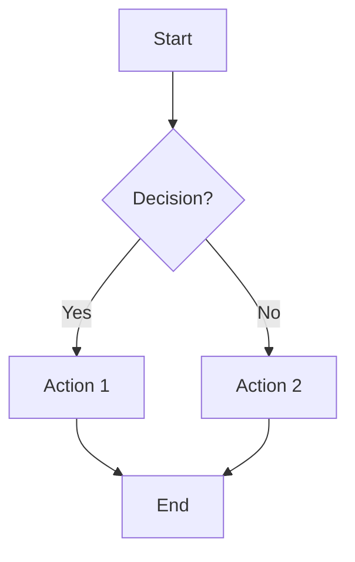
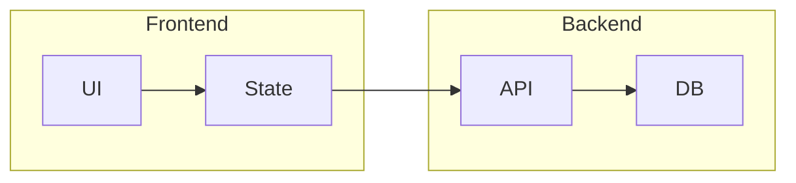
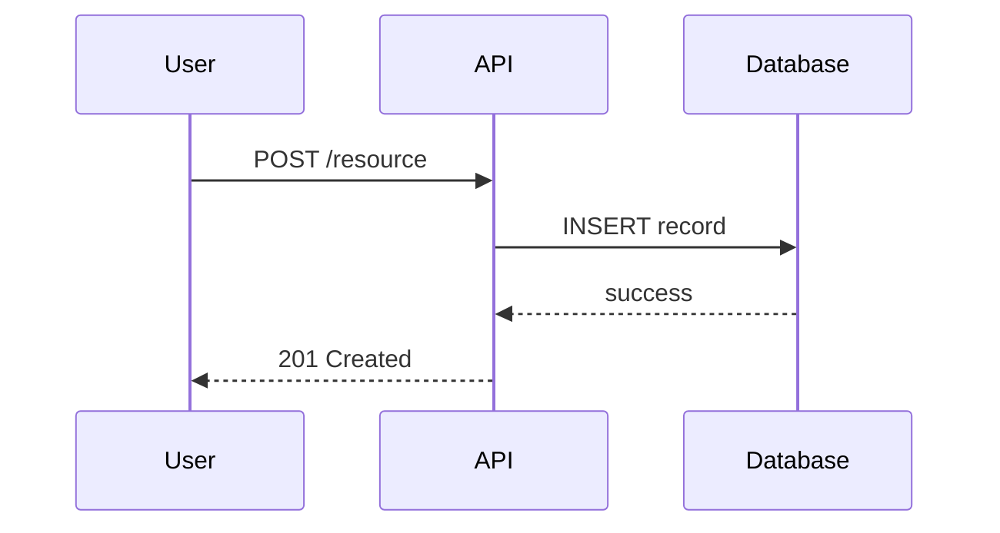
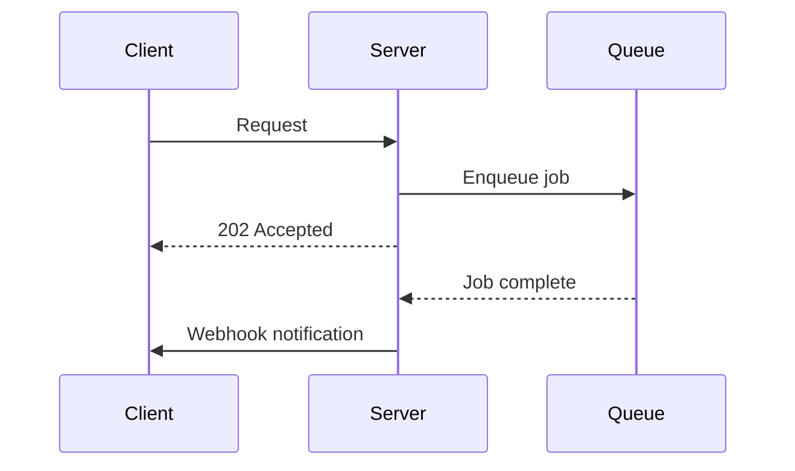
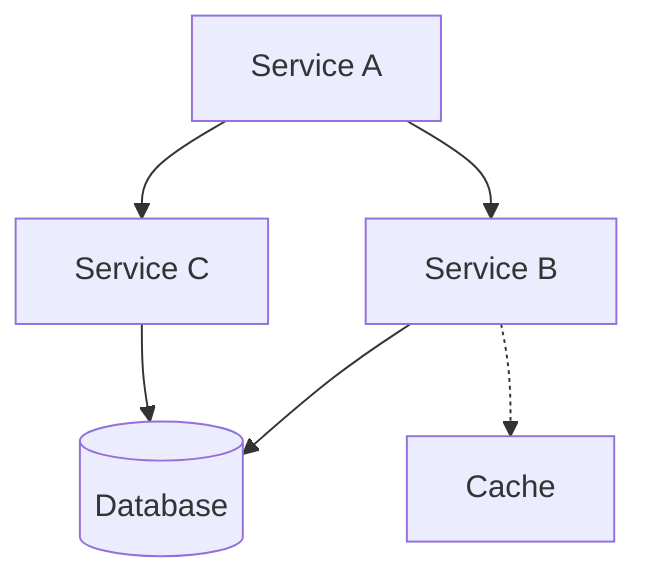
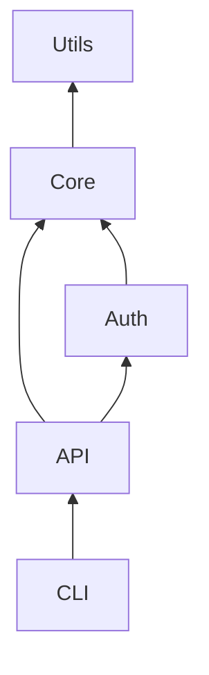
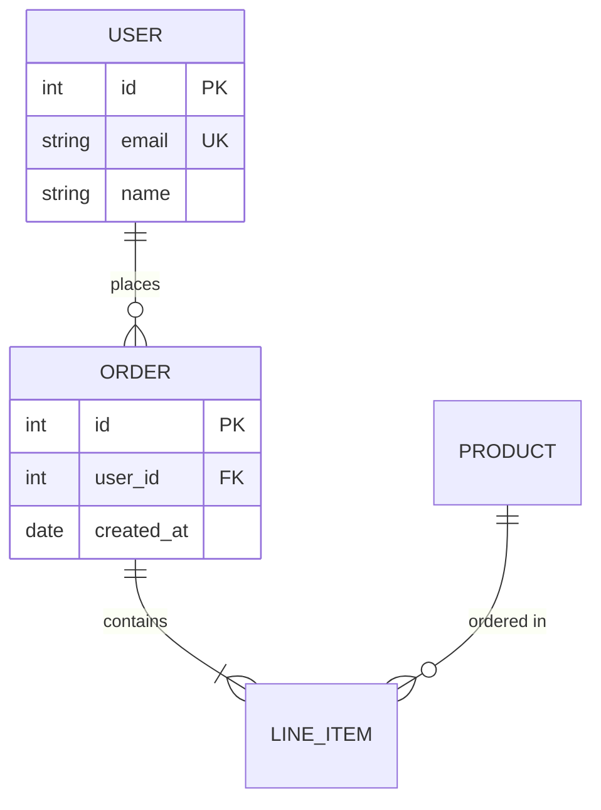
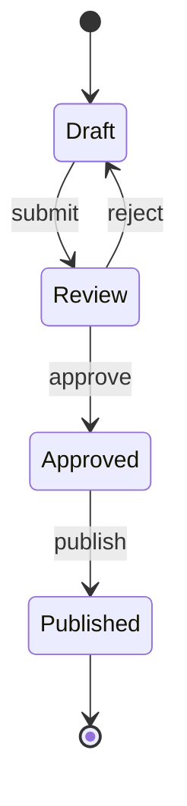
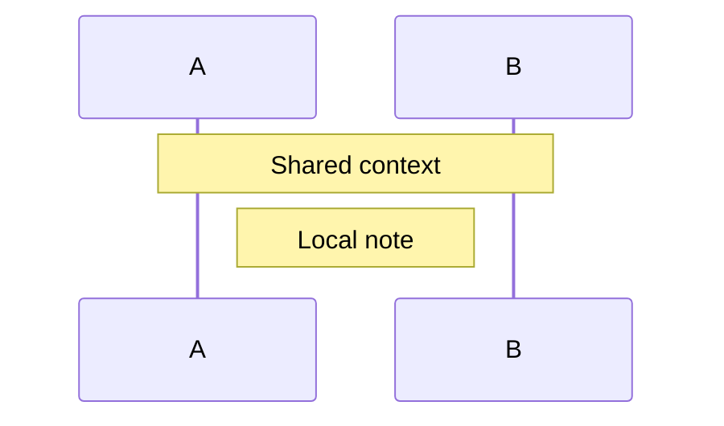

# Mermaid Diagram Templates

## Flowchart - Process/Decision Flow

### With Subgraphs (Component Grouping)

## Sequence Diagram - Interactions Over Time

### With Async/Parallel

## Component/Graph Diagram - Relationships

### Dependency Graph

## ER Diagram - Data Models

## State Diagram - State Machines

## Styling Tips

### Node Shapes
- `[text]` - Rectangle (process)
- `{text}` - Diamond (decision)
- `([text])` - Stadium (start/end)
- `[(text)]` - Cylinder (database)
- `((text))` - Circle (connector)

### Arrow Types
- `-->` - Solid arrow
- `-.->` - Dotted arrow
- `==>` - Thick arrow
- `-->>` - Async/response
- `--x` - Cross (failure)

### Adding Notes

