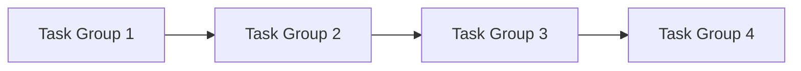

# Tasks: [Feature Name]

> **Spec**: [link to spec.md](spec.md)
> **Created**: [date]
> **Status**: Not Started | In Progress | Complete

---

## Task Overview

| Group | Name | Dependencies | Status |
|-------|------|--------------|--------|
| TG1 | [Name] | None | ⬜ |
| TG2 | [Name] | TG1 | ⬜ |
| TG3 | [Name] | TG2 | ⬜ |
| TG4 | [Name] | TG3 | ⬜ |

---

## Task Group 1: [Name] (e.g., Database Layer)

**Dependencies**: None
**Estimated**: [time estimate]

### Tests First (2-8 tests)
- [ ] Test: [test description]
- [ ] Test: [test description]
- [ ] Test: [test description]

### Implementation
- [ ] [Sub-task 1]
- [ ] [Sub-task 2]
- [ ] [Sub-task 3]

### Verification
- [ ] Run tests: `[specific test command for this group only]`
- [ ] All tests pass

### Acceptance Criteria
- [Criterion 1]
- [Criterion 2]

---

## Task Group 2: [Name] (e.g., API Layer)

**Dependencies**: TG1
**Estimated**: [time estimate]

### Tests First (2-8 tests)
- [ ] Test: [test description]
- [ ] Test: [test description]

### Implementation
- [ ] [Sub-task 1]
- [ ] [Sub-task 2]

### Verification
- [ ] Run tests: `[specific test command for this group only]`
- [ ] All tests pass

### Acceptance Criteria
- [Criterion 1]

---

## Task Group 3: [Name] (e.g., Frontend)

**Dependencies**: TG2
**Estimated**: [time estimate]

### Tests First (2-8 tests)
- [ ] Test: [test description]
- [ ] Test: [test description]

### Implementation
- [ ] [Sub-task 1]
- [ ] [Sub-task 2]

### Verification
- [ ] Run tests: `[specific test command for this group only]`
- [ ] All tests pass

### Acceptance Criteria
- [Criterion 1]

---

## Task Group 4: [Name] (e.g., Integration & Polish)

**Dependencies**: TG3
**Estimated**: [time estimate]

### Tests First (2-8 tests)
- [ ] Test: [E2E test description]
- [ ] Test: [Integration test description]

### Implementation
- [ ] [Sub-task 1]
- [ ] [Sub-task 2]

### Verification
- [ ] Run full test suite
- [ ] Manual testing complete

### Acceptance Criteria
- [Criterion 1]

---

## Final Checklist

- [ ] All task groups complete
- [ ] All tests passing
- [ ] Code reviewed
- [ ] Documentation updated
- [ ] Ready for verification phase
