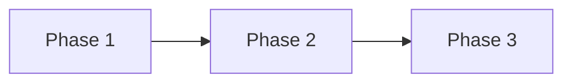

# Product Roadmap

## Vision
[One sentence describing the product vision]

## Current State
- **Version**: [current version or "New Project"]
- **Status**: [Active Development / Maintenance / Planning]
- **Last Updated**: [date]

---

## Milestones

### Phase 1: [Name] (Target: [date])
**Goal**: [One sentence goal]

**Features**:
- [ ] [Feature 1] - `spec: [spec-name]`
- [ ] [Feature 2] - `spec: [spec-name]`

**Success Criteria**:
- [Measurable outcome 1]
- [Measurable outcome 2]

---

### Phase 2: [Name] (Target: [date])
**Goal**: [One sentence goal]

**Features**:
- [ ] [Feature 1] - `spec: [spec-name]`
- [ ] [Feature 2] - `spec: [spec-name]`

**Success Criteria**:
- [Measurable outcome 1]
- [Measurable outcome 2]

---

### Phase 3: [Name] (Target: [date])
**Goal**: [One sentence goal]

**Features**:
- [ ] [Feature 1] - `spec: [spec-name]`
- [ ] [Feature 2] - `spec: [spec-name]`

**Success Criteria**:
- [Measurable outcome 1]
- [Measurable outcome 2]

---

## Dependencies

## Risks & Mitigations

| Risk | Impact | Likelihood | Mitigation |
|------|--------|------------|------------|
| [Risk 1] | High/Med/Low | High/Med/Low | [Strategy] |

## Notes
- [Any additional context]
