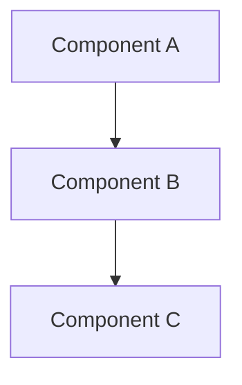

# Specification: [Feature Name]

> **Status**: Draft | Review | Approved
> **Created**: [date]
> **Author**: [name/agent]

## 1. Overview

### 1.1 Summary
[2-3 sentences describing what this feature does]

### 1.2 Goals
- [Primary goal]
- [Secondary goal]

### 1.3 Non-Goals
- [What this feature explicitly does NOT do]

---

## 2. User Stories

### Primary
1. **As a** [user], **I want** [action], **so that** [benefit].

### Secondary
1. **As a** [user], **I want** [action], **so that** [benefit].

---

## 3. Requirements

### 3.1 Functional Requirements

| ID | Requirement | Priority |
|----|-------------|----------|
| FR1 | [Description] | P0 |
| FR2 | [Description] | P1 |

### 3.2 Non-Functional Requirements

| ID | Requirement | Metric |
|----|-------------|--------|
| NFR1 | Performance | [e.g., <200ms response] |
| NFR2 | Security | [e.g., encrypted at rest] |

---

## 4. Technical Approach

### 4.1 Architecture

### 4.2 Data Model
[Describe key entities and relationships - no actual schema code]

### 4.3 API Design
[Describe endpoints/interfaces - no implementation code]

### 4.4 Key Algorithms
[Describe approach in prose - no code]

---

## 5. Reusable Code

### Existing Components to Leverage
- `[path/to/component]` - [what it provides]
- `[path/to/utility]` - [what it provides]

### Patterns to Follow
- [Pattern name] as seen in `[file path]`

---

## 6. Testing Strategy

### Unit Tests
- [Key unit test scenarios]

### Integration Tests
- [Key integration test scenarios]

### E2E Tests
- [Key E2E scenarios]

---

## 7. Rollout Plan

### 7.1 Feature Flags
- [Flag name and purpose]

### 7.2 Migration
- [Any data migration needed]

### 7.3 Rollback
- [Rollback strategy]

---

## 8. Open Questions
- [ ] [Question requiring decision]

## 9. References
- [Link to requirements](planning/requirements.md)
- [Link to visuals](planning/visuals/)
